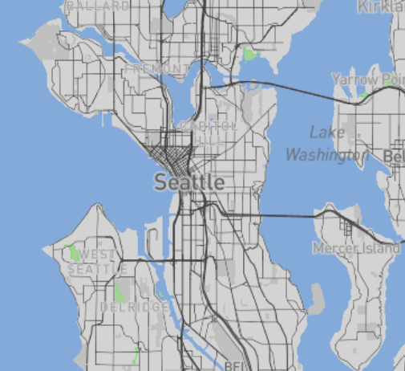

# Map-Design-and-Tile-Generation

## Abstract 
This repository focuses on Map Design and Tile Generation using QGIS, with data sourced from Mapbox. The geographical scope centers around Seattle, and the primary objective is to create interactive tile maps illustrating car collisions within the city. The repository encompasses data collection from the Seattle City GIS platform, followed by wrangling and the utilization of QGIS for tile map design. The tile sets presented in this repository visually represent various aspects of car collisions in Seattle, providing a comprehensive view of the integrated mapping process

## Data Collection & Wrangling
The dataset for this project was sourced from [Seattle City GIS - SDOT Collisions (All Years)](https://data-seattlecitygis.opendata.arcgis.com/datasets/SeattleCityGIS::sdot-collisions-all-years-2/about). Initially, the dataset contained information on collisions spanning all years, providing a comprehensive overview. However, due to the substantial size of the original dataset, a data wrangling process was implemented using Python.

The [wrangling process](/data_wrangling.ipynb) involved filtering the data to focus specifically on car collisions that occurred in January 2024. This refined dataset includes essential information such as [longitude, latitude, and additional relevant details](/filtered_data_2024_v2.csv). By narrowing down the scope to a specific timeframe, the dataset becomes more manageable and targeted, facilitating a more precise exploration and representation of car collisions within the selected geographical area.

## Tile Sets Description
1)  Custom Mapbox Design: A unique map crafted in Mapbox, transformed into tiles using QGIS.
2) Collision Data Tile Map: Tiles depicting collision data points within Seattle, providing insight into the spatial distribution of incidents.
3) Integrated Custom Map and Collision Data: Overlay of collision data points onto the custom Mapbox design, showcasing the intersection of the two datasets.
4) Creative Chinese New Year Theme: A creatively themed tile set centered around Chinese New Year, adding a distinctive and celebratory touch to the mapping project.

## Interactive tile map map below
Link to Interactice map: [index.html](https://raw.githack.com/lesther-dumos/Map-Design-and-Tile-Generation/main/index.html)

